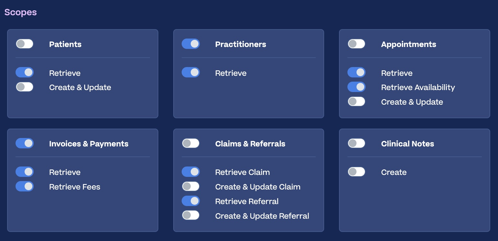

# halaxy-mcp

An [MCP](https://modelcontextprotocol.io) server for the [Halaxy](https://www.halaxy.com/) practice-management API, written in Python. It lets an MCP client (Claude, GitHub Copilot, etc.) answer questions like "what's on my calendar today", "which of today's appointments haven't been invoiced yet", or "what invoices are outstanding with a given insurer", by talking to your own Halaxy account.

This is a small, single-tenant tool built for one practice's own use, not a general-purpose Halaxy SDK - see [What it deliberately doesn't do](#what-it-deliberately-doesnt-do) below.

## Tools

- **`list_invoices(date)`** - invoices dated a given day (defaults to today). Each invoice has a `payer_name` (always present) and a `patient` object (only present when the payer is an actual patient, not an insurer/employer).
- **`list_appointments(date, appointment_type)`** - appointments for a given day, each tagged `"session"` (a real client appointment) or `"meeting"` (a blocker/reminder/internal note - anything with no linked patient). Sessions also carry:
  - `session_mode` - `"F2F"` or `"Telehealth"`, resolved from the HealthcareService the appointment is booked against
  - `patient` - `id`/`name`/`initials`/`telecom`/`patient_status`/`is_active_client` (see [Patient data](#patient-data) below)
  - `invoice` - the linked invoice, if one's been raised, via Halaxy's direct appointment→invoice reference (more reliable than matching by date - see the notes in the code)
  - `awaiting_insurer_invoice` - populated only when there's no invoice yet *and* the patient has an active Coverage on file flagged "billed to an organisation" - i.e. flags a session that's expected to be billed to an insurer/employer but hasn't been yet
  - `referrals` - the patient's active Referral(s) (see `list_referrals` below), so their current session count is right there without a second call

  Cancelled appointments are excluded entirely (`cancelled_count` reports how many). This was a real bug, found and fixed: Halaxy's `Appointment?date=eq...` search returns cancelled appointments right alongside real ones, with nothing at the top level marking them as such - one showed up looking like a perfectly ordinary upcoming session. The obvious-looking `cancellationReason` field is *not* reliable by itself (confirmed against real data - many genuinely-cancelled appointments don't have it set); the signal that held up is the Patient participant's `appointment-participant-status` **modifierExtension** (not `extension`) being `"cancelled"`.

  Meetings also carry `availability_hint` - a best-effort *guess* at whether the meeting is non-working/blocked time (a break, leave, etc.), matching keywords in `description` or a blank description. **This is not a real Halaxy field and not availability data** - `likely_non_working: true` must never be read as "free to book a client into". Confirmed against real calendar screenshots: Halaxy's own UI shows generic blocker titles (e.g. "BREAK") for meetings the API returns with a *completely blank* `description` - there's no field anywhere carrying that title, so keyword-matching alone would miss real blockers entirely; the blank-description signal is what actually catches them, at lower confidence.
- **`list_practitioners()`** - clinical staff, each with their PractitionerRole ID and name, so a client can resolve "what's on for Alice today" to a role ID before matching it against `list_appointments`.
- **`list_invoices_by_payer(payer_name)`** - every invoice ever billed to a specific insurer/employer/organisation (e.g. "Acme Insurance"), not tied to any date - searches Halaxy's `Invoice?recipient=` directly, so it doesn't have `list_invoices`'s lookback-window blind spot (see below).
- **`list_referrals(flag)`** - every active Referral in the practice - Halaxy's model for a GP/other referral authorizing a set number of sessions and/or dollars under a funding scheme (most commonly a Medicare Mental Health Treatment Plan - "6 sessions to start", as most people know it - but also DVA, WorkCover, etc). Each carries `sessions_total`/`sessions_used`/`sessions_remaining`, `amount_total`/`amount_used`, expiry, and computed `flags`: `"over_limit"` (used ≥ authorized), `"expiring_soon"` (ends within 30 days), `"expired"`. Optionally filter to just one flag - e.g. "who's about to run out of sessions".
- **`find_patient(name)`** - searches for a patient/client by name (e.g. "Jane Citizen", or just "Citizen"), returning id/name/initials/telecom/patient_status/is_active_client for every match - the tool behind "what's \<client\>'s phone number" style questions. Confirmed live: Halaxy's `Patient` search supports a `name` parameter matching case-insensitively against both given and family name. Common surnames can genuinely match more than one real patient - deliberately returns every match rather than guessing, so a common name comes back as multiple results to disambiguate rather than silently picking one.

## Required Halaxy API key scopes

Create an API key in Halaxy (Settings → API Keys) with whichever of these you need - the server degrades gracefully if a scope is off, it'll just fail on the tools that need it:

| Scope (as labelled in Halaxy's UI) | Used by |
|---|---|
| Appointments → Retrieve | `list_appointments` |
| Invoices & Payments → Retrieve, Retrieve Fees | `list_invoices`, `list_invoices_by_payer` |
| Practitioners → Retrieve | `list_practitioners`, practitioner names in `list_appointments` |
| Patients → Retrieve | Patient names/telecom/status in `list_appointments`, `find_patient` |
| Claims & Referrals → Retrieve Claim | `awaiting_insurer_invoice`, `list_invoices_by_payer` (this is Halaxy's plain-English label for read access to the FHIR `Coverage` resource) |
| Claims & Referrals → Retrieve Referral | `list_referrals`, `referrals` in `list_appointments` (read access to the FHIR `Referral` resource) |

Example of what this looks like in Halaxy's own API key scope screen:



## Patient data

This server deliberately minimises what it exposes about a patient. Halaxy's `Patient` resource also carries DOB, address, gender, emergency contact, and referral-source notes - none of that is needed here, and it's enforced in code (`ALLOWED_PATIENT_FIELDS` in `halaxy_mcp.py`), not just by convention: every patient lookup is filtered down to `id`/`name`/`initials`/`telecom`/`patient_status`/`is_active_client` before it can reach the MCP client, regardless of what's asked for.

**Clinical/session notes are not retrievable through this API at all, for any key or scope.** Halaxy's own `/metadata` capability statement shows its clinical-notes resource (`DocumentReference`) supports `create`/`patch` only - no read, matching what the Halaxy UI itself shows (Clinical Notes only has a Create toggle). This is a whole-API limitation, not something this server chooses not to expose.

## Referrals and session limits

Halaxy models a GP Mental Health Treatment Plan (and similar - DVA, WorkCover) as a `Referral` linked to a `ReferralDefinition` (the referral *type*, which carries the session/dollar cap - e.g. one real `ReferralDefinition` in testing was literally named "Medicare: MHTP Referral" with a 6-session limit). `sessions_remaining` isn't returned by Halaxy directly; it's computed here as `sessions_total - sessions_used`.

A few things confirmed against real data, worth knowing if you extend this further:
- A patient can have more than one simultaneously-active Referral (e.g. one per referred-to practitioner) - this server doesn't try to guess "the" one; it returns all of them.
- `sessions_used` can exceed `sessions_total` in practice (Medicare doesn't hard-stop bookings at the cap) - that's what the `"over_limit"` flag is for.
- Some Referral records have no structured type/referrer at all, just a free-text `comment` - surfaced as-is when that's the only clue available.
- Halaxy's own `active` field on a Referral doesn't appear to auto-flip to false once its period lapses - the `"expired"`/`"expiring_soon"` flags are computed from `period.end`, not read off `active`.

## If a scope isn't enabled

Every tool needs its matching scope switched on for the API key it's using (see the table above). If a scope is missing, Halaxy responds with a 401/403 or an `OperationOutcome` error - the server raises a clear `HalaxyPermissionError` (naming the resource, the HTTP status, and Halaxy's own error text) rather than silently treating that as "zero results". Without this check, a missing scope and a genuinely empty result (e.g. "no invoices today") would look identical to the MCP client.

## Install

Requires Python 3.10+.

```bash
git clone https://github.com/ryanhunt/halaxy-mcp.git
cd halaxy-mcp
python3 -m venv .venv
source .venv/bin/activate
pip install -r requirements.txt
cp .env.example .env
# then edit .env with your Halaxy API key's client_id/client_secret
```

Sanity-check it runs:

```bash
source .venv/bin/activate
python3 halaxy_mcp.py
```

It won't print anything and will just sit there - that's correct, it's waiting for an MCP client to talk to it over stdin/stdout. Ctrl+C to stop it.

## Wiring it into an MCP client

All of these spawn the same script as a local subprocess and talk to it over stdio - no network port, no separate deployment. Use the **full, absolute path** to the `.venv`'s Python and to `halaxy_mcp.py` in every case.

**Claude Desktop** - add to `claude_desktop_config.json` (`~/Library/Application Support/Claude/claude_desktop_config.json` on macOS):

```json
{
  "mcpServers": {
    "halaxy-mcp": {
      "command": "/absolute/path/to/halaxy-mcp/.venv/bin/python3",
      "args": ["/absolute/path/to/halaxy-mcp/halaxy_mcp.py"]
    }
  }
}
```

Fully quit and reopen the app afterwards (not just close the window).

**VS Code (GitHub Copilot)** - add `.vscode/mcp.json` in a workspace:

```json
{
  "servers": {
    "halaxy-mcp": {
      "type": "stdio",
      "command": "/absolute/path/to/halaxy-mcp/.venv/bin/python3",
      "args": ["/absolute/path/to/halaxy-mcp/halaxy_mcp.py"]
    }
  }
}
```

**GitHub Copilot CLI** - add to `~/.copilot/mcp-config.json` (or run `/mcp add` inside the CLI):

```json
{
  "mcpServers": {
    "halaxy-mcp": {
      "type": "local",
      "command": "/absolute/path/to/halaxy-mcp/.venv/bin/python3",
      "args": ["/absolute/path/to/halaxy-mcp/halaxy_mcp.py"],
      "tools": ["*"]
    }
  }
}
```

No `env` block is needed in any of these - the script loads its own `.env` file from next to `halaxy_mcp.py`.

## Docker / HTTP transport

For a remote MCP client that connects from cloud infrastructure rather than a local device (Claude's "custom connector", Microsoft 365 Copilot's "federated connector"), run the same script over HTTP instead of stdio: `MCP_TRANSPORT=http` starts a `uvicorn` server instead of talking over stdin/stdout - the Dockerfile sets this for you.

**Auth**: real OAuth 2.1, not a static token. Confirmed against Claude's actual "Add custom connector" dialog: it requires a genuine OAuth flow (there's no field to paste a bearer token into - only optional "OAuth Client ID/Secret" fields).

**Leave those OAuth Client ID/Secret fields blank.** This server supports Dynamic Client Registration - Claude registers itself automatically the first time someone connects, generating its own client_id on the fly. Confirmed live: pre-filling either field breaks the connection, since Dynamic Client Registration is the *only* registration path this server implements - there's no pre-registered client for Claude to use instead.

Rather than standing up a separate identity provider, this server acts as its own minimal, self-contained OAuth authorization server - adapted from Anthropic's own reference pattern ([`examples/servers/simple-auth`](https://github.com/modelcontextprotocol/python-sdk/tree/main/examples/servers/simple-auth) in `modelcontextprotocol/python-sdk`, the "legacy" combined authorization-server-plus-resource-server mode). `_SimpleOAuthProvider` handles client registration, `/authorize`, a plain login page (`/login`), authorization codes, and access tokens - **persisted to a small JSON file** (`MCP_OAUTH_STATE_FILE`, defaults to `oauth_state.json` next to the script; in Docker this points at `/data`, mounted as a volume in both compose files) rather than kept purely in memory. This matters in practice: without it, every `docker compose up --build` (i.e. every code update) restarts the process and silently wipes every registered client and access token, forcing every connected client to reconnect - which surfaces as an opaque "permission required"-style error with no obvious cause. The state file holds live access tokens, so it's written with `0600` permissions and via a temp-file-then-rename (atomic on POSIX, so a crash mid-write can't leave a corrupt file behind) - it's gitignored and never baked into the image. "Signing in" is one shared username/password (`MCP_LOGIN_USERNAME`/`MCP_LOGIN_PASSWORD` in `.env`) - not a per-person identity system, which is a reasonable simplification for a small practice/team. `MCP_PUBLIC_URL` is the public HTTPS URL clients actually reach this server at (behind Caddy on a real deployment) - the OAuth issuer/redirect base, and *not* the same as the internal `MCP_HOST`/`MCP_PORT` the container binds to.

**Test locally** (no TLS - fine for local testing, not for internet exposure):

```bash
cp .env.example .env   # fill in your Halaxy credentials + MCP_LOGIN_USERNAME/PASSWORD
docker compose up --build
curl http://127.0.0.1:8000/health   # -> 200, no auth needed
curl http://127.0.0.1:8000/mcp      # -> 401, no token
curl http://127.0.0.1:8000/.well-known/oauth-authorization-server  # -> OAuth discovery metadata
```

An MCP client does the rest automatically (register → authorize → login → token exchange) - verified this full flow by hand with curl through the actual container before relying on it.

**Deploy it somewhere internet-facing** (e.g. a Raspberry Pi behind your own router): use `docker-compose.pi.yml` instead, which adds [Caddy](https://caddyserver.com/) in front for TLS (Let's Encrypt, auto-issued/renewed) and doesn't publish the app's port directly - only Caddy is reachable from outside the container network.

This builds **directly on the target device** - no cross-compilation needed. Docker just produces whatever architecture image matches the device's own CPU, automatically. Verified working on both 64-bit (`arm64`/`aarch64` - a Pi 3B+ and up) and 32-bit (`armv7`/`armhf` - a Pi 2, or a Pi 3/4 on 32-bit Raspberry Pi OS) by actually building and running the image under QEMU emulation for both, not just assuming it'd work.

```bash
# check what you're running, if unsure:
uname -m   # armv7l = 32-bit, aarch64 = 64-bit

# install Docker via its official apt repo (not the get.docker.com script -
# Docker's own docs say that's not recommended for anything you'll keep
# running). Covers armhf as well as arm64/amd64:
sudo apt update
sudo apt install -y ca-certificates curl
sudo install -m 0755 -d /etc/apt/keyrings
sudo curl -fsSL https://download.docker.com/linux/debian/gpg -o /etc/apt/keyrings/docker.asc
sudo chmod a+r /etc/apt/keyrings/docker.asc
echo \
  "deb [arch=$(dpkg --print-architecture) signed-by=/etc/apt/keyrings/docker.asc] https://download.docker.com/linux/debian \
  $(. /etc/os-release && echo "$VERSION_CODENAME") stable" | \
  sudo tee /etc/apt/sources.list.d/docker.list > /dev/null
sudo apt update
sudo apt install -y docker-ce docker-ce-cli containerd.io docker-buildx-plugin docker-compose-plugin
sudo usermod -aG docker $USER   # log out/in afterwards

git clone https://github.com/ryanhunt/halaxy-mcp.git
cd halaxy-mcp
cp .env.example .env && nano .env   # Halaxy credentials, MCP_LOGIN_USERNAME/PASSWORD, MCP_PUBLIC_URL
cp Caddyfile.example Caddyfile && nano Caddyfile   # your real domain/DDNS hostname

docker compose -f docker-compose.pi.yml up -d --build
```

`MCP_PUBLIC_URL` (in `.env`) must be the real `https://your-domain` clients will connect to - it's used as the OAuth issuer/redirect base and has to match exactly. `docker compose -f docker-compose.pi.yml ps`/`logs -f` to check it's up; `restart: unless-stopped` means it survives a reboot as long as Docker itself starts on boot (the install script above enables that by default). To update later: `git pull && docker compose -f docker-compose.pi.yml up -d --build` - or just `./update.sh`, which does the same thing and then polls `/health` on `MCP_PUBLIC_URL` a few times to confirm it actually came back up. Nothing in `.env`/`Caddyfile` is touched by `git pull` (both are gitignored).

**Building for 32-bit ARM (`armv7`) needs a bit more than `pip install`, already handled in the Dockerfile**: `cryptography` (pulled in for the OAuth code) has prebuilt wheels for 64-bit platforms but not `armv7` - there it compiles a small piece (`cffi`) from source, which needs a C compiler and libc's headers. The Dockerfile installs `gcc`/`libc6-dev`/`libffi-dev` before `pip install` and removes them again afterwards to keep the image small - worth knowing if you ever modify the Dockerfile yourself, since `libc6-dev` in particular is easy to leave out by mistake (it's only a "Recommends" of `gcc` on Debian, not a hard dependency, so `--no-install-recommends` silently drops it and the build fails with a `stdlib.h: No such file or directory` error).

You'll still need to handle port-forwarding (80+443) and firewall rules on your own network/router - and as defense-in-depth on top of the login gate, consider restricting inbound traffic to your MCP client's currently-published outbound IP ranges (these change over time, so check the current values rather than hardcoding them).

## Confirmed working with

- **Claude** (custom connector) - the full OAuth flow (register → login page → connect) has been verified end-to-end against a real deployment, not just locally.
- **GitHub Copilot** (VS Code, Visual Studio, Copilot CLI) - the stdio path (above) is verified; the HTTP/OAuth path hasn't specifically been tried with it, but there's no reason to expect it wouldn't work the same way, since it's the same standard OAuth 2.1 + Dynamic Client Registration flow Claude and ChatGPT use.
- **Microsoft 365 Copilot** (via a Copilot Studio agent with an MCP tool) - confirmed working. See [Setting this up in Microsoft 365 Copilot](#setting-this-up-in-microsoft-365-copilot) below - it's not the same "paste a URL" flow as Claude.
- **ChatGPT** - confirmed working, unmodified. Good evidence this server's plain OAuth 2.1 + Dynamic Client Registration implementation is portable across MCP clients generally, not tuned to one client's specific behaviour.

### Setting this up in Microsoft 365 Copilot

Unlike Claude's "paste a URL and connect" custom connector, Microsoft 365 Copilot doesn't let you add a private server directly to its own connector gallery - that gallery (called "federated connectors") requires Microsoft's review/approval to list a server there at all, which isn't viable for a private/self-hosted tool. The actual self-service path is **Copilot Studio** - a separate product used to build a small "agent" that's then published into Teams/Microsoft 365 Copilot:

1. In Copilot Studio, create an **Agent** (not "Workflow" - that's for automated multi-step processes, not tool-calling).
2. On the agent's **Tools** page: **Add a tool** → **New tool** → **Model Context Protocol**.
3. **Server URL**: `https://your-domain.example.com/mcp`. **Authentication type**: OAuth 2.0.
4. Try **"Dynamic discovery"** first - it's built for exactly what this server supports (Dynamic Client Registration). If it fails (this server exposes the older `/.well-known/oauth-authorization-server` discovery style, which satisfied Claude and ChatGPT, but not the newer RFC 9728 `/.well-known/oauth-protected-resource` metadata some clients look for first), fall back to the **"Dynamic"** option and fill in manually:
   - **Authorization URL**: `https://your-domain.example.com/authorize`
   - **Token URL template**: `https://your-domain.example.com/token`
5. Write **Instructions** for the agent describing what it can help with and its real limits - it's worth being explicit, since the agent won't otherwise know what the underlying tools can't do.
6. **Publish**, selecting **Teams + Microsoft 365** as the channel.

**Licensing, worth knowing before you start**: building an agent in Copilot Studio needs *some* Copilot Studio access (a trial license lets you build and test in the builder's own preview panel, but can't publish). *Using* a published agent through Microsoft 365 Copilot Chat/Teams needs a real (paid, not free "Basic") Microsoft 365 Copilot license for each user - per Microsoft's own billing docs, agent actions (which includes calling an MCP tool) are "No charge" against that license for real end-use, so once real licenses are assigned, ongoing usage for a small team shouldn't need a separate Copilot Studio credit purchase or Azure pay-as-you-go setup. If a newly-assigned license doesn't seem to take effect immediately, try a full sign-out/sign-in before assuming something's actually wrong - license propagation can lag behind the assignment itself.

## Known limitations, worth knowing about

- **`list_invoices`'s lookback window can miss invoices.** Halaxy's `Invoice` search has no parameter for the invoice's own `date` field, only `created`/`_lastUpdated` - so `list_invoices` fetches invoices created in the last 45 days and filters client-side for an exact `date` match. Insurer/employer-billed invoices (e.g. workers' comp) are sometimes created months before the session they end up dated for, which can fall outside that window. `list_appointments` doesn't have this problem (it follows the appointment→invoice link directly), and `list_invoices_by_payer` doesn't either (it searches by recipient, unbounded by date) - prefer those when the date-based blind spot matters.
- **`session` vs. `meeting` is inferred from whether the appointment has a linked `Patient` participant**, not from any explicit Halaxy field - a real session booked without linking a patient record in Halaxy would be miscategorised as a meeting.
- No write operations (create/update anything) are implemented, on purpose.
- The HTTP transport's OAuth authorization server is a minimal, self-contained implementation with one shared login (not per-person accounts) and in-memory state (tokens don't survive a restart) - see [Docker / HTTP transport](#docker--http-transport) above. Verified working against Claude's connector requirements specifically; other MCP clients may expect something different.

## What it deliberately doesn't do

This wraps a handful of read-only endpoints matching one practice's own needs, not a general Halaxy/FHIR client. It does not implement patient creation/updates, clinical notes, scheduling changes, or most of Halaxy's ~50-resource FHIR surface (referral *tracking* is covered - see above - but not creating/updating referrals). If you need more of the API, the tool functions in `halaxy_mcp.py` are a reasonably short, readable starting point to extend from.

## License

GPLv3 - see [LICENSE](LICENSE).
